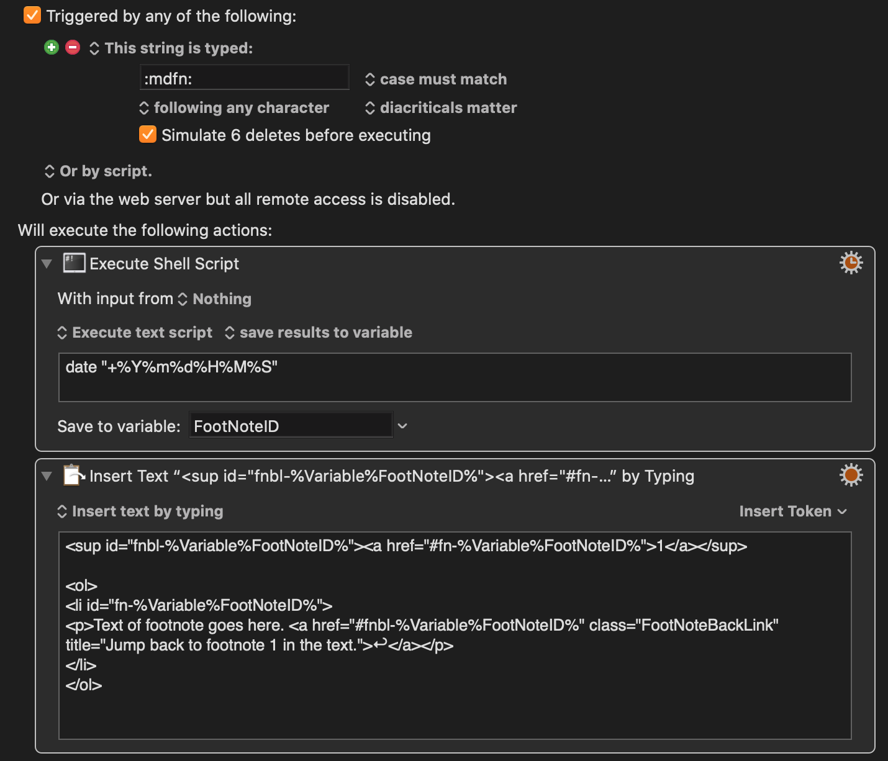

# Footnotes in Markdown

Using markdown is great. Creating and using footnotes in markdown is very manual. Painful even.

So I've created a Keyboard Maestro shortcut to make them easier.

What it does is run a shell script to get the current date and time and saves that to a variable.

Then we *insert by typing* the HTML code to do the superscript<a href="#fn-20200519095757">1</a> for the foot note, then a line below insert an ordered list with a list item where the footnote text goes. Of course, we then move that to the bottom of the document. If you've got a way to auto do that and jump back to where we inserted, please let me know.

[Download the macro](../images/kbm-mdfn.kmmacros)

<ol>
	<li id="fn-20200519095757">
		
Text of footnote goes here. <a href="#fnbl-20200519095757" class="FootNoteBackLink" title="Jump back to footnote 1 in the text.">↩︎</a>

	</li>
</ol>

